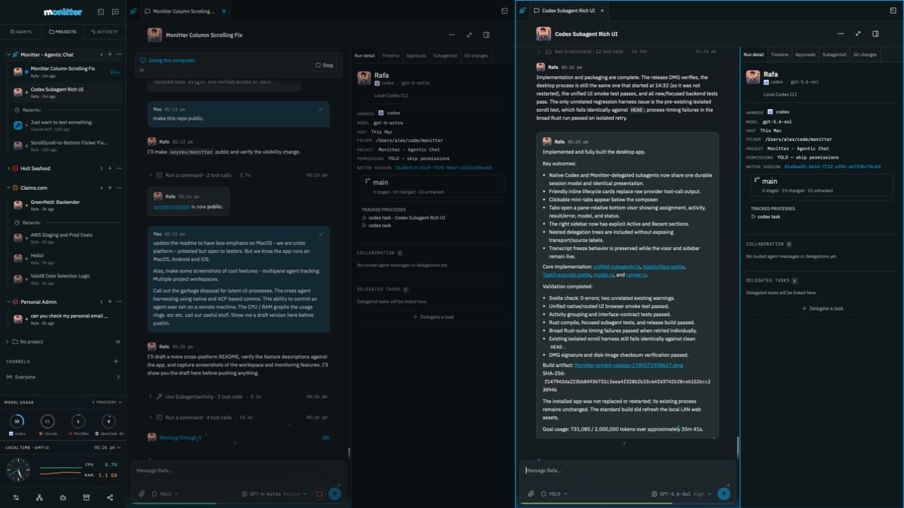
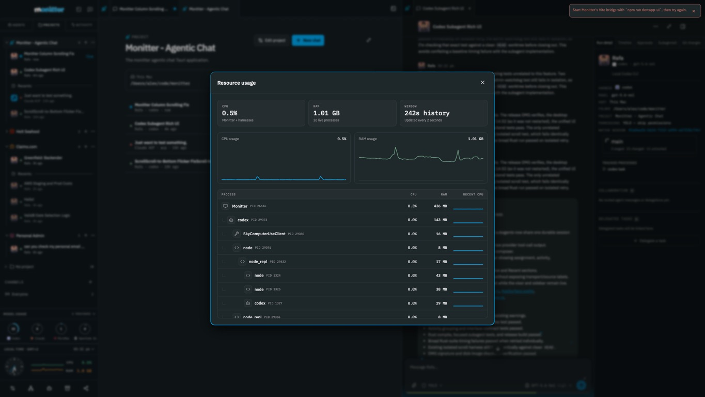

# Monitter

> [!IMPORTANT]
> **Early alpha.** I’m building Monitter for myself, but I think it has the potential to be useful to others. Expect rough edges and frequent changes. Testers, feedback, and contributions are welcome.

**Your agents, together.**

A cross-platform workspace for running, watching, and coordinating AI agents. Keep multiple conversations in view, give every project its own workspace, and work with agents on your computer or a remote machine over SSH.

Monitter brings your existing CLI harnesses into one interface. It uses their native sessions and authentication, with native adapters and support for the **Agent Client Protocol (ACP)**.

**Known to run on macOS, Android, and iOS. Windows and Linux are untested—we welcome testers and contributions.** The mobile apps are paired controllers: agents keep running on the connected desktop or its configured remote hosts.



*Real Monitter workspace: two agent chats side by side, with project navigation and monitoring in the sidebar.*

## A workspace for more than one agent

- **Multiple panes.** Keep agent conversations side by side, follow parallel work, and expand the pane that needs your attention.
- **Project workspaces.** Group chats by project, switch between saved workspaces, and configure working folders for local and SSH hosts. One project can involve several agents and machines.
- **Persistent conversations.** Keep native session IDs, transcripts, tabs, and execution settings together. Resume work without turning every follow-up into a new session.
- **Cross-agent collaboration.** Let supported agents discover peers, exchange messages, and delegate linked tasks. The receiving agent uses its own harness and host, and results return to the originating conversation.
- **Native and ACP harnesses.** Native adapters cover Codex, Claude Code, OpenCode, and Hermes. ACP connects compatible agents through a common protocol, locally or over SSH. Capabilities vary by harness; a successful connection is not a guarantee that every provider feature is supported.

## Keep the work visible



*Resource monitoring shows the app and its owned harness processes together.*

- **CPU and RAM graphs.** See Monitter and its owned harness processes in the sidebar, then open a resource breakdown with usage history and per-process details. Native resource monitoring is currently macOS-specific.
- **Provider usage rings.** Watch reported account allowances and reset windows for supported providers, including Codex, Claude, MiniMax, and OpenCode Go. Missing or stale readings are shown explicitly.
- **Context and goals.** See reported context usage and supported goal budgets alongside the conversation. The goal box stays above the composer while messages scroll.
- **Readable activity.** Inspect tool calls, available reasoning summaries, errors, approvals, and run details without losing the conversation. Scroll back to read while new output waits for you.
- **Git and terminals.** Inspect the current branch and changes, view tracked processes, and open a terminal in the chat's working folder.

## A garbage disposal for idle CLI processes

Persistent agents should not mean an ever-growing collection of idle processes.

Monitter's runtime collector retires eligible local harnesses after more than five minutes of inactivity, freeing their processes and disposable helpers while preserving the conversation and native session. Your next message resumes that session.

Cleanup is conservative: active work, queued messages, pending approvals, and uncertain background jobs keep a runtime alive. It only targets processes Monitter owns. Automatic retirement currently covers eligible macOS Codex app-server, Claude stream-json, and resumable ACP sessions; SSH runtimes are retained.

## Your agents can live on another machine

Configure a host, working folder, and harness executable, then control the agent over **SSH** from the same workspace.

Monitter uses your system SSH configuration, keys, and host-key checks. The harness must already be installed and authenticated on the remote machine. Native and ACP connections use that machine's session and credentials; Monitter does not replace the harness with its own model API.

## Take the conversation with you

- **Android and iOS controllers.** Pair a phone with the desktop to read conversations, send messages, and stop work. Execution stays on the host.
- **Browser sharing.** Share selected chats or project scope through an approval-based invitation. Guests join by name, and shared chat supports uploads and read-only model, effort, permissions, and context information where available.
- **Observer presence.** A sparkling eye shows connected observers with access to a chat; its tooltip lists their names.
- **Make it yours.** Light and dark themes, configurable accents, interface scaling, tab styles, and flexible pane layouts.

## Platform status

| Platform | Status |
| --- | --- |
| macOS | Confirmed running; main desktop development and validation platform. |
| Android | Confirmed running as a paired mobile controller. |
| iOS | Confirmed running as a paired mobile controller. |
| Windows | Untested. Build and compatibility reports welcome. |
| Linux | Untested. Build and compatibility reports welcome. |

This is an actively developed project, not a claim of feature parity across platforms. Desktop packaging, native process monitoring, and harness integration need more cross-platform testing. Provider support also depends on the installed CLI or ACP bridge and its version.

## Build and try it

The desktop app uses **Tauri 2, Rust, Svelte 5, and TypeScript**. Install Node/npm, Rust, and the native Tauri build dependencies for your operating system. On macOS, this includes Xcode command-line tools.

```sh
npm ci
npm run tauri dev
```

Agent execution requires a configured host with an installed, authenticated harness. `npm run dev` runs the browser design preview; it does not start native agents.

```sh
npm run check
npm run build
cargo test --manifest-path src-tauri/Cargo.toml
```

Platform build instructions:

- macOS: `npm run build:mac`, then `npm run install:mac`. For a local debug package, use `npm run build:mac:local` and `npm run install:mac -- --debug`.
- Android: [Android build and pairing guide](mobile-android/README.md).
- iOS: [iOS build and device guide](mobile-ios/README.md).

The macOS build is locally ad-hoc signed; this is not a notarized public installer.

For frontend development with an installed macOS app, run `npm run dev:app-ui`, then choose **Monitter → Load Hot-Reload UI**. Follow the LAN access pairing prompt if requested. Backend changes still require a rebuild. Run only one hot-reload server on port 18420 at a time.

## Testers welcome

Especially on Windows and Linux: try building the desktop app, connect a harness, and tell us what works and what breaks. Mobile device reports and native/ACP compatibility reports are welcome too.

When opening an issue, include your OS and version, Monitter commit, harness/version, whether the connection is local or SSH, and steps to reproduce. Remove credentials and private conversation content from logs and screenshots.

## More detail

- [Architecture and command boundary](docs/CONTRACT.md)
- [ACP adapter and compatibility](docs/ACP-ADAPTER.md)
- [Idle runtime retirement](docs/IDLE-RUNTIME-RETIREMENT.md)
- [Mobile controller](docs/MOBILE-CONTROLLER.md)
- [Validation evidence and known limits](docs/VALIDATION.md)
- [Shared browser interface](share-web/README.md)
- [Design reference](design/reference.html)

Monitter is independently implemented. [Orbit](https://github.com/xinnaider/orbit) informed early CLI execution and resume patterns. Bundled font licenses are in `static/licenses/`.

The built-in collaboration MCP runs in Rust over loopback HTTP. Local harnesses connect
directly; SSH harnesses use an owned reverse tunnel. Codex, Claude, OpenCode and
compatible ACP sessions receive scoped collaboration tools. The Python MCP relay
has been removed; other Python integrations remain. See [the Rust HTTP MCP notes](docs/RUST-HTTP-MCP.md).
